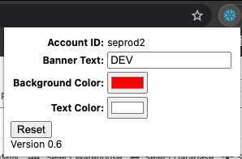

# Snowflake Browser Banner
Add banners to Snowflake to quickly differentiate between Snowflake environments.

## Hide Banner
Mousing over the banner will make it hide and automatically reappear after 10 seconds.

## Click on Snowflake Icon to Customize
Change the text, background color, and text color using the dropdown

## Preview App
Also works in the new Preview App

View the README.md file in each folder corresponding to the browser for instructions on how to install

---

**NOTE** This is not an official Snowflake tool. Use at your own discretion.